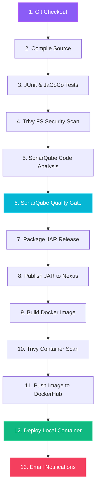

# 🎲 BoardUniverse DevOps CI/CD Comprehensive Guide

Welcome to the beginner-friendly guide for the **BoardUniverse** CI/CD (Continuous Integration & Continuous Deployment) pipeline! This document explains exactly how our software delivery pipeline works, why we use each tool, and how a beginner can understand and run it easily.

---

## 🛠️ What is CI/CD? (For Beginners)

When writing code, developers follow a process to verify that their changes work. In traditional software development, this is done manually:
1. Compile the code to check for syntax errors.
2. Run tests to ensure no features are broken.
3. Package the application into a release file (e.g., a `.jar` file).
4. Deploy the file to a server so users can access it.

**CI/CD automates this entire process.** 
- **Continuous Integration (CI)**: Automatically builds, compiles, tests, and scans your code every time a new change is pushed to GitHub. This ensures the codebase is always healthy and secure.
- **Continuous Delivery/Deployment (CD)**: Automatically packages the application into a container, uploads it to a registry, and deploys it onto the production server.

---

## 🏗️ The BoardUniverse Pipeline Architecture

Here is the exact journey your code takes from your keyboard to the active local server:



---

## 🧰 The DevOps Tool Stack Explained

| Tool | Role | Why We Use It (The Beginner Explanation) |
| :--- | :--- | :--- |
| **Git & GitHub** | Version Control | Keeps track of code changes and hosts the code online. |
| **Jenkins** | Orchestrator | The "brain" that runs and coordinates all stages of the pipeline. |
| **Apache Maven** | Build Tool | Compiles, tests, and packages the Spring Boot Java project. |
| **JUnit 5** | Test Framework | Executes unit tests to verify database and controller logic. |
| **JaCoCo** | Coverage Tracker | Measures what percentage of your source code is tested. |
| **Trivy** | Security Scanner | Scans files and container layers to find security vulnerabilities. |
| **SonarQube** | Code Quality | Checks code for "smells" (bad style), bugs, and potential security leaks. |
| **Nexus OSS** | Artifact Storage | A private digital vault for keeping safe versions of your packaged JAR files. |
| **Docker** | Containerization | Packages the app into an isolated container that runs the same on any computer. |
| **DockerHub** | Image Registry | A public library for uploading and distributing Docker images. |

---

## 🔍 Detailed Breakdown of Every Pipeline Stage

### 1. Git Checkout
- **What it does**: Jenkins pulls the latest source code from your GitHub repository.
- **Why**: Ensures we are building the absolute newest version of the project.

### 2. Compile
- **What it does**: Jenkins runs `mvn compile` on your code.
- **Why**: Checks that all Java classes compile successfully with no syntax errors.

### 3. Test
- **What it does**: Jenkins runs `mvn test` to execute your JUnit test cases.
- **Why**: Validates that all controllers and database queries function correctly. JaCoCo also generates a report showing test coverage.

### 4. Trivy Filesystem Scan
- **What it does**: Runs the Trivy scanner against the project files.
- **Why**: Detects if your project uses third-party libraries (like older versions of Spring or H2) that have known security bugs.

### 5. SonarQube Analysis
- **What it does**: Scans the source code and uploads findings to a SonarQube server.
- **Why**: Evaluates code quality, structure, and detects potential vulnerabilities.

### 6. Quality Gate
- **What it does**: Pauses the pipeline to wait for SonarQube's verdict.
- **Why**: Ensures no bad code gets deployed. If the code does not meet quality requirements, Jenkins stops the pipeline here.

### 7. Build Package
- **What it does**: Bundles the code into a runnable archive file (`database_service_project-0.0.5.jar`).
- **Why**: Packages all compiled code and assets into a single file ready for execution.

### 8. Publish to Nexus
- **What it does**: Uploads the packaged `.jar` to your local Nexus repository.
- **Why**: Stores a locked, official version of your release so you can download past builds at any time.

### 9. Docker Build
- **What it does**: Uses the multi-stage [Dockerfile](file:///d:/STUDY/Coding/Projects/docker/BoardUniverse/Dockerfile) to build a secure, lightweight container image.
- **Why**: Isolates your application along with the exact Java runtime it needs to run, keeping the image size optimized.

### 10. Trivy Image Scan
- **What it does**: Scans the built container image layers.
- **Why**: Hardens the production container by checking if the base operating system (Alpine Linux) contains any security threats.

### 11. Docker Push
- **What it does**: Uploads the container image to your public **DockerHub** repository (`manish26m/boardgame:latest`).
- **Why**: Makes the ready-to-run container available worldwide.

### 12. Deploy Local Container
- **What it does**: Runs a script that stops any older container named `boardgame`, removes it, and runs the new one:
  ```bash
  docker run -d -p 8085:8080 --name boardgame manish26m/boardgame:latest
  ```
- **Why**: Instantly deploys the fresh code updates live on port **`8085`**!

### 13. Email Notification
- **What it does**: Jenkins collects build duration, status, and scan logs, sending an automated HTML report to `manish.mishra2605@gmail.com`.
- **Why**: Instantly updates you on whether the deployment was successful or if any vulnerability requires attention.

---

## 🚦 How to Run & Verify the Application

### 1. View the Standalone Dev Server (Direct Run)
For active visual editing, the application runs directly on your computer's port `8082`:
👉 **Access URL**: **[http://localhost:8082](http://localhost:8082)**

### 2. Run the Full Jenkins Pipeline
1. Open your browser and head to: **[http://localhost:8080/job/boardgame-pipeline/](http://localhost:8080/job/boardgame-pipeline/)**
2. Login with your Jenkins account.
3. Click **"Build Now"** in the left-hand menu.
4. Watch the stages build, compile, scan, and deploy in real-time.

### 3. View the Production Containerized Website
Once the Jenkins deploy stage finishes successfully, your website runs securely inside a Docker container:
👉 **Access URL**: **[http://localhost:8085](http://localhost:8085)**

### 🔑 Demo Accounts to Log In
Once on the website, click **Login** and try the demo accounts:
- **Collector Account (Can add games & post reviews)**:
  - Username: `bugs` | Password: `bunny`
- **Manager Account (Can edit & delete reviews)**:
  - Username: `daffy` | Password: `duck`
